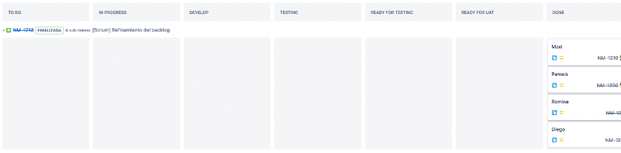
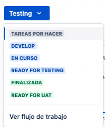
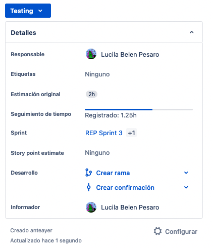
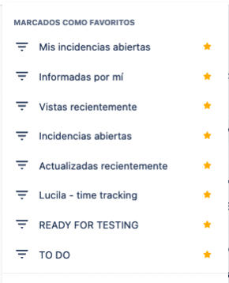
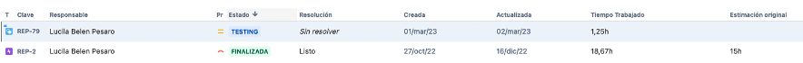

## JIRA

JIRA es una popular herramienta de gestión de proyectos y seguimiento de incidencias desarrollada por Atlassian. Se utiliza ampliamente en equipos de desarrollo de software y empresas de diferentes sectores para planificar, rastrear y administrar proyectos, tareas y problemas.

### Características principales

1. **Gestión de incidencias**: JIRA permite crear y rastrear incidencias, problemas o tareas en un proyecto. Puedes asignar tareas a diferentes miembros del equipo, establecer prioridades, adjuntar archivos y comentarios, y realizar un seguimiento del progreso de cada incidencia.

2. **Seguimiento de proyectos**: JIRA facilita el seguimiento del progreso de un proyecto. Puedes crear tableros Kanban o diagramas de Gantt para visualizar las tareas y su estado actual. Esto ayuda a mantener a todos los miembros del equipo informados sobre las tareas pendientes, en progreso y completadas.

3. **Colaboración y comunicación**: JIRA proporciona características para la colaboración en equipo. Puedes comentar en incidencias, mencionar a otros miembros del equipo y adjuntar archivos relevantes. Además, los equipos pueden recibir notificaciones y actualizaciones en tiempo real sobre cambios en los proyectos.

4. **Personalización y extensiones**: JIRA es altamente personalizable y permite adaptarlo a las necesidades específicas de cada proyecto o equipo. Puedes crear campos personalizados, flujos de trabajo y paneles de control personalizados. También hay una amplia gama de complementos disponibles en el Marketplace de Atlassian para extender las funcionalidades de JIRA.

5. **Integraciones**: JIRA se integra con muchas otras herramientas populares utilizadas en el desarrollo de software, como repositorios de código (como Git y GitHub), herramientas de CI/CD (como Jenkins), herramientas de colaboración (como Confluence) y sistemas de seguimiento de versiones (como Bitbucket).

## Beneficios de usar JIRA

1. **Planificación flexible**: JIRA permite una planificación ágil y flexible. Puedes crear y asignar tareas, establecer fechas de vencimiento, prioridades y dependencias. Además, puedes utilizar metodologías como Scrum o Kanban para organizar y visualizar el progreso del proyecto.

2. **Elaboración de informes**: JIRA ofrece una amplia gama de informes y paneles de control para monitorear el progreso del proyecto. Puedes generar informes personalizados sobre el rendimiento del equipo, el tiempo dedicado a las tareas y el flujo de trabajo general. Estos informes ayudan a tomar decisiones basadas en datos y a identificar áreas de mejora.

3. **Integración con otras herramientas**: JIRA se integra con una variedad de herramientas y sistemas utilizados en el desarrollo de software. Puedes conectar JIRA con repositorios de código (como Git y GitHub), sistemas de seguimiento de versiones (como Bitbucket), herramientas de CI/CD (como Jenkins), herramientas de colaboración (como Confluence) y más. Estas integraciones facilitan la sincronización de información y la colaboración entre diferentes equipos y herramientas.

4. **Automatización de tareas**: JIRA permite la automatización de tareas repetitivas y flujos de trabajo. Puedes crear reglas y disparadores para realizar acciones automáticas, como asignar tareas, enviar notificaciones, cambiar estados de incidencias y más. Esto ahorra tiempo y reduce errores manuales, mejorando la eficiencia del equipo.

## Tipos de equipos y sectores que utilizan JIRA

JIRA es utilizado por una amplia gama de equipos y sectores en diferentes industrias. Algunos de los sectores comunes que utilizan JIRA incluyen:

1. Servicios financieros
2. Comercio minorista
3. Software y tecnología
4. Alta tecnología
5. Automoción
6. Organizaciones sin ánimo de lucro
7. Gobierno
8. Biología y ciencias de la vida
9. Telecomunicaciones
10. Educación
11. Energía y servicios públicos
12. Salud y atención médica
13. Medios y entretenimiento
14. Industria manufacturera
15. Consultoría empresarial

Estos son solo algunos ejemplos de los muchos sectores en los que JIRA se utiliza ampliamente. Debido a su versatilidad y capacidad de personalización, JIRA se adapta a las necesidades de diferentes equipos y organizaciones, sin importar su industria o sector.

## Funciones específicas de JIRA para cada metodología ágil

JIRA ofrece funciones específicas para diferentes metodologías ágiles, que ayudan a los equipos a gestionar sus proyectos de manera efectiva. A continuación se presentan algunas de las funciones clave para cada metodología:

### Scrum:
- **Tableros Scrum**: JIRA proporciona tableros ágiles que permiten a los equipos Scrum visualizar y gestionar su trabajo mediante la creación de tareas, asignación de puntos de historia, seguimiento del progreso y establecimiento de prioridades.
- **Sprints**: JIRA facilita la planificación y ejecución de sprints, permitiendo la creación de backlog de sprints, seguimiento del progreso de las tareas y generación de informes sobre la velocidad del equipo.
- **Paneles Scrum**: Los paneles Scrum en JIRA ofrecen una visión general del progreso del sprint, permitiendo a los equipos rastrear las tareas completadas, las tareas pendientes y los impedimentos.

### Kanban:
- **Tableros Kanban**: JIRA ofrece tableros Kanban personalizables, donde los equipos pueden visualizar y gestionar su flujo de trabajo mediante la creación de columnas que representan las etapas del proceso.
- **WIP (Work In Progress)**: JIRA permite limitar el trabajo en progreso, estableciendo límites para las columnas del tablero Kanban, lo que ayuda a mantener un flujo de trabajo equilibrado y a identificar cuellos de botella.
- **Visualización del flujo de trabajo**: JIRA proporciona métricas y gráficos para visualizar el flujo de trabajo, como el tiempo promedio de ciclo y el tiempo de espera, lo que ayuda a identificar áreas de mejora.

### Informes y análisis:
- **Informes personalizados**: JIRA permite generar informes personalizados para cada metodología ágil, como informes de sprint, informes de velocidad, informes de tiempo dedicado y muchos más.
- **Métricas y gráficos**: JIRA ofrece una variedad de métricas y gráficos para evaluar el rendimiento del equipo y el progreso del proyecto, como la velocidad del equipo, la tendencia de finalización de tareas y la distribución del tiempo.
- **Informes de burndown/burnup**: JIRA proporciona informes de burndown y burnup que muestran visualmente el progreso del proyecto en relación con las tareas pendientes y las estimaciones iniciales.

### Integraciones:
- **Integración con repositorios de código**: JIRA se integra con herramientas de control de versiones como Git y GitHub, permitiendo una trazabilidad completa entre los commits y las tareas relacionadas en JIRA.
- **Integración con herramientas de CI/CD**: JIRA se puede integrar con herramientas de integración continua y despliegue continuo (CI/CD) como Jenkins, lo que permite una mayor automatización y seguimiento del estado de implementación de tareas.
- **Integración con herramientas de colaboración**: JIRA se integra con herramientas de colaboración como Confluence, lo que facilita la documentación y el intercambio de información entre el equipo.

La integración de Jira con otras herramientas es una de sus ventajas, ya que permite a los equipos trabajar con las aplicaciones que ya conocen y les gustan, mejorando la colaboración y la productividad. Algunas de las herramientas con las que se integra Jira son:

1. **Trello**: Conecta Jira y Trello para ayudar a todos los equipos a colaborar mejor.
2. **Slack**: Conecta proyectos de Jira con tus canales de Slack para que todo el equipo pueda tener conversaciones relacionadas.
3. **Gmail**: Visualiza información actualizada sobre incidencias de Jira y actúa sobre ellas desde la bandeja de entrada de Gmail.
4. **Adobe XD**: Permite a los equipos acceder fácilmente a los últimos prototipos de Adobe XD y especificaciones de diseño para incidencias de Jira.
5. **InVision**: Trae tu flujo de trabajo de diseño a Jira para dar a cada incidencia contexto instantáneo con acceso a diseño siempre actualizado.
6. **Figma**: Los cambios en los diseños y prototipos de Figma se actualizan automáticamente en tu incidencia de Jira.
7. **Bitbucket, GitHub y Gitlab**: Consulta el código y el estado de implementación de un solo vistazo en Jira.
8. **Confluence**: Crea, lee, actualiza y elimina artículos de la base de conocimientos directamente en Jira Service Management.
9. **Opsgenie**: Colabora para resolver los incidentes más rápido y restaurar los servicios críticos con escalación de incidentes graves con un solo clic.

Un ejemplo de integración de Jira con otra herramienta es el uso de la aplicación oficial de Jira Cloud para Slack. Supongamos que tienes un proyecto de desarrollo de software en Jira Software y quieres comunicarte con tu equipo en Slack. Con esta integración, puedes recibir notificaciones sobre las incidencias de Jira en Slack, crear o comentar incidencias desde Slack, usar comandos o accesos directos para interactuar con Jira, y ver información detallada sobre las incidencias en Slack. Esto facilita la colaboración entre desarrolladores y otras partes interesadas, manteniendo a todos actualizados.

## Gestión de versiones

La gestión de versiones con Jira es una forma de organizar y planificar el trabajo en torno a hitos específicos de un proyecto. Las versiones representan momentos determinados en los que se publica una funcionalidad o se corrige un error para los clientes. 

Para gestionar versiones con Jira, puedes seguir estos pasos:

1. Crea una versión en Jira Software con un nombre, una fecha y una descripción.
2. Añade tickets a una versión arrastrándolos desde el backlog o editando el campo "Versión de corrección".
3. Planifica y haz un seguimiento del trabajo en la vista de Cronograma para ver las dependencias y los plazos de las versiones.
4. Supervisa el progreso y la velocidad de las versiones con informes y paneles.
5. Publica una versión cuando esté lista y archívala si ya no es relevante.

Un ejemplo de gestión de versiones con Jira es el siguiente:

Supongamos que tienes un proyecto de desarrollo de una aplicación web y quieres publicar una nueva versión cada mes con las funcionalidades y correcciones que has implementado. Puedes crear una versión en Jira Software llamada 1.0 y asignarle la fecha de publicación prevista. Luego, puedes añadir los tickets que quieres incluir en esa versión, como nuevas características, mejoras o errores. Después, puedes usar la vista de Cronograma para ver cómo se distribuyen las tareas en el tiempo y si hay alguna dependencia o retraso que afecte a la fecha de publicación. También puedes utilizar informes como el diagrama de trabajo pendiente o completado, el informe de sprints o el gráfico de velocidad para ver cómo avanza tu equipo hacia la finalización de la versión. Finalmente, cuando hayas terminado el trabajo y hayas probado la calidad del software, puedes publicar la versión 1.0 y notificar a tus clientes. A continuación, puedes crear una nueva versión 1.1 y repetir el proceso.

## Personalización avanzada

La personalización avanzada de Jira es una forma de adaptar Jira a las necesidades específicas de tu equipo o proyecto. Con la personalización avanzada, puedes crear y modificar diferentes elementos de Jira, como:

- **Tipos de tickets**: Puedes crear tus propios tipos de tickets para clasificar el trabajo según su naturaleza, como historias de usuario, bugs, tareas, etc. También puedes definir los campos y las pantallas que se muestran para cada tipo de ticket.

- **Flujos de trabajo**: Puedes crear tus propios flujos de trabajo para reflejar el proceso que sigue tu equipo para completar el trabajo. Puedes definir los estados, las transiciones, las condiciones, los validadores y los desencadenantes que se aplican a cada tipo de ticket.

- **Tableros**: Puedes crear tus propios tableros para visualizar el trabajo en curso y gestionarlo de forma ágil. Puedes definir el tipo de tablero (scrum o kanban), el filtro de tickets, las columnas, los límites y otras opciones.

- **Informes**: Puedes crear tus propios informes para medir y analizar el rendimiento de tu equipo o proyecto. Puedes elegir entre diferentes tipos de informes, como diagramas de trabajo pendiente o completado, informes de sprints, gráficos de velocidad, etc. También puedes personalizar los parámetros y los criterios de los informes.

Un ejemplo de personalización avanzada de Jira es el siguiente:

Supongamos que tienes un proyecto de desarrollo web y quieres crear un tipo de ticket personalizado para las solicitudes de cambio que recibes de tus clientes. Puedes crear un tipo de ticket llamado "Solicitud de cambio" y asignarle un icono y un color distintivos. Luego, puedes definir los campos que quieres que tenga ese tipo de ticket, como el cliente, la prioridad, la fecha límite, el alcance del cambio, etc. Después, puedes crear una pantalla personalizada para mostrar esos campos cuando se crea o se edita una solicitud de cambio. Finalmente, puedes crear un flujo de trabajo personalizado para ese tipo de ticket, con estados como "Pendiente", "Aprobado", "Rechazado", "En progreso" y "Completado", y con transiciones que indiquen cómo se puede pasar de un estado a otro.

## Colaboración en tiempo real

La colaboración en tiempo real con Jira es una forma de trabajar con tu equipo de forma sincronizada y transparente, aprovechando las funciones y las integraciones de Jira. Con la colaboración en tiempo real, puedes:

- Comunicarte con tu equipo: Puedes usar herramientas como Slack, Microsoft Teams o Confluence para conectar tus proyectos de Jira con tus canales de comunicación. Así, podrás recibir notificaciones, crear o comentar tiques, ver información detallada y más desde tu herramienta preferida.

- Visualizar el trabajo en curso: Puedes usar tableros de scrum o kanban para ver el estado y el avance de las tareas de tu equipo. También puedes usar la vista de Cronograma para ver las dependencias y los plazos de las versiones.

- Medir y analizar el rendimiento: Puedes usar informes y paneles para ver métricas e indicadores clave sobre la productividad, la calidad, la velocidad y la satisfacción de tu equipo. También puedes compartir los informes con otras partes interesadas o exportarlos a otros formatos.

- Automatizar tareas repetitivas: Puedes usar Jira Automation para crear reglas que se ejecuten cuando se cumplan ciertas condiciones, como asignar tiques, enviar correos electrónicos, actualizar campos, etc. Así, podrás ahorrar tiempo y evitar errores.

Un ejemplo de colaboración en tiempo real con Jira es el siguiente:

Supongamos que tienes un equipo de desarrollo web que usa Jira Software para gestionar sus proyectos y Slack para comunicarse. Puedes usar la aplicación oficial de Jira Cloud para Slack para integrar tus proyectos con tus canales. De esta forma, podrás recibir notificaciones sobre los cambios en los tiques de Jira en Slack, crear o comentar tiques desde Slack, usar comandos o accesos directos para interactuar con Jira y ver información detallada sobre los tiques en Slack. Así, podrás mantener a tu equipo al día y facilitar la colaboración entre desarrolladores y otras partes interesadas.

## Gestión de casos de prueba

La gestión de requisitos y casos de prueba con Jira es una forma de especificar, organizar y ejecutar pruebas para verificar y validar los requisitos de un proyecto de software. Con la gestión de requisitos y casos de prueba con Jira, puedes:

- Definir los requisitos: Puedes crear y documentar los requisitos del proyecto usando tipos de tickets como historias de usuario, tareas o bugs. También puedes vincular los requisitos con otras incidencias, como epics, versiones o casos de prueba.

- Crear los casos de prueba: Puedes crear y especificar los casos de prueba usando tipos de tickets personalizados o integrando herramientas externas de gestión de pruebas, como Visure Requirements, Zephyr, qTest, TestRail o Xray. También puedes definir las condiciones previas, los pasos, las entradas y los resultados esperados de cada caso de prueba.

- Organizar los casos de prueba: Puedes organizar y agrupar los casos de prueba usando conjuntos de pruebas, carpetas o etiquetas. También puedes asignar prioridades, componentes o versiones a los casos de prueba para facilitar su gestión.

- Ejecutar los casos de prueba: Puedes ejecutar los casos de prueba manualmente o mediante automatización usando herramientas como Selenium, Cucumber o JUnit. También puedes registrar los resultados de las pruebas, el tiempo empleado y los defectos encontrados.

- Seguir el progreso y la calidad: Puedes seguir el progreso y la calidad de las pruebas usando informes y paneles que muestran métricas e indicadores clave, como la cobertura de requisitos, el estado de ejecución, la velocidad del equipo o la satisfacción del cliente.

Un ejemplo de gestión de requisitos y casos de prueba con Jira es el siguiente:

Supongamos que tienes un proyecto de desarrollo web y quieres gestionar los requisitos y los casos de prueba con Jira. Puedes usar el tipo de ticket "Historia" para crear y documentar los requisitos del proyecto, como "Como usuario quiero registrarme en la web". Luego, puedes usar el tipo de ticket "Caso de prueba" para crear y especificar los casos de prueba asociados a cada requisito, como "Verificar que el usuario puede registrarse con un correo electrónico válido". Después, puedes organizar y agrupar los casos de prueba usando conjuntos de pruebas o etiquetas, como "Registro" o "Funcionalidad". A continuación, puedes ejecutar los casos de prueba manualmente o mediante automatización y registrar los resultados, el tiempo y los defectos en Jira. Finalmente, puedes seguir el progreso y la calidad de las pruebas usando informes y paneles que te muestran la información relevante sobre las pruebas.

# Ejemplo de uso de JIRA

¿El equipo usa Épicas, historias de usuario, subtareas e incidencias para gestionar sus proyectos y reportes de defectos? ¿Usa otra terminología o clasificaciones?
¿Qué clasificaciones de severidad utiliza? ¿Cuántos niveles de prioridad hay? ¿Qué pasos o estados puede atravesar un caso de desarrollo (o historia de usuario)?
¿Qué pasos o estados puede atravesar un caso para una incidencia o defecto? ¿Cómo es el proceso de reporte de defectos?

**A continuación como se mostraría un tablero tipo Kanban dentro de Jira, los diferentes estados del trabajo en curso y terminados.**

Cada columna representa un estado. Cada registro de caso de desarrollo, incidencia o de los tipos de proyecto que se usen, se ubican bajo la columna que representa el estado actual del proyecto.

Estados: 
- Por hacer
- En progreso
- En desarrollo
- Listo para testear
- Testeando
- Listo para UAT
- Terminado

Para actualizar el estado de un proyecto simplemente se selecciona la opción correspondiente del listado.

Esto es solo un ejemplo muy básico y  tu equipo podría manejar otros estados u otra terminología para referirse a las diferentes fases por las que atraviesa cada proyecto.

Los tipos de proyecto también se pueden configurar. Por defecto podrás encontrar:

Así se observa el panel de detalles de un proyecto que está siendo testeado:

Tal como se observa, es posible asignar:
- Responsable al proyecto
- Nombre de quien creo o informó el proyecto
- Etiquetas
- Estimación y tracking real de horas dedicadas
- Story points si se estima en story points
- Sprint
- Rama de desarrollo

Ten en cuenta que se puede configurar los campos que se deben mostrar y su orden.
Jira permite filtrar la información para visualizarla en listas. Los usuarios con permisos para crear y guardar sus listas o reportes, pueden generar marcadores.
Esto es útil para visualizar el trabajo pendiente rápidamente.

Filtrar información y generar tus propios reportes y listas,  anclarlos a un menú de acceso rápido es verdaderamente importante para ayudarte a:
 
- Visualizar rápidamente los proyectos que tienen en proceso
- Tener visibilidad sobre proyectos o tareas prioritarias
- Encontrar la información de forma fácil y rápida
- Compartir información o reportes con otras personas
