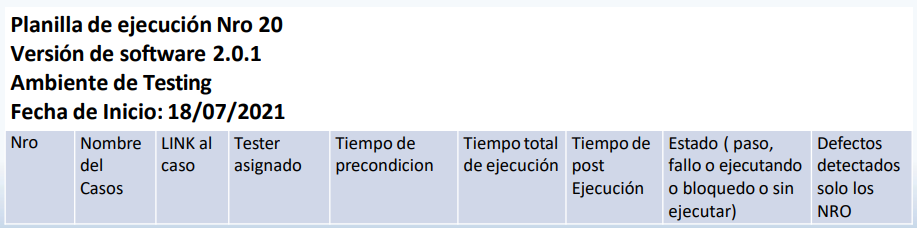

# Test Suite

## Test Set o Test Suite o Plan de Casos a Ejecutar

El Test Set, también conocido como Test Suite o Plan de Casos a Ejecutar, es un conjunto de casos de prueba planificados para ser ejecutados en una versión específica de software. Estos casos de prueba están diseñados para evaluar y validar el funcionamiento del software en desarrollo antes de su lanzamiento.

El Test Set se crea con el objetivo de cubrir los aspectos críticos y las funcionalidades clave del software que se está generando. Dependiendo de la etapa de desarrollo, el Test Set puede incluir casos de prueba para una versión intermedia, una versión de pre-producción o incluso una versión de producción.

La planificación del Test Set implica la selección y priorización de los casos de prueba más relevantes para la versión en cuestión. Estos casos de prueba pueden abarcar diferentes áreas funcionales, escenarios de uso, condiciones límite y requerimientos específicos del software.

Algunos puntos clave a considerar al planificar el Test Set son:

1. Identificar los casos de prueba relevantes para la versión en desarrollo.
2. Priorizar los casos de prueba según su importancia y nivel de riesgo.
3. Asegurarse de que el Test Set cubra adecuadamente las funcionalidades clave y los requerimientos del software.
4. Considerar los escenarios de uso realistas y las condiciones límite para una cobertura completa.
5. Asegurarse de que el Test Set sea adecuado para la etapa de desarrollo específica (intermedia, pre-producción, producción).
6. Realizar una revisión y validación del Test Set antes de la ejecución.

La ejecución del Test Set implica seguir el plan definido, ejecutando los casos de prueba y registrando los resultados correspondientes. Estos resultados son evaluados para identificar posibles defectos o problemas en el software, los cuales pueden ser corregidos antes del lanzamiento.

Es importante recordar que el Test Set es dinámico y puede evolucionar a medida que se descubren nuevos requerimientos o se realizan modificaciones en el software. Por lo tanto, es recomendable mantener una gestión y seguimiento constante del Test Set para garantizar su efectividad.

## Test Set o Test Suite o Plan de casos a ejecutar

El Test Set, también conocido como Test Suite o Plan de casos a ejecutar, es la agrupación de casos de pruebas y test charters asignados a una versión específica del software que se está probando. Esta asignación se realiza en base a la funcionalidad que se está evaluando en dicha versión.

El Test Set se crea como parte del plan de testing y puede incluir diferentes conjuntos de casos de pruebas que abarcan distintas áreas funcionales o aspectos del software. Dependiendo del plan de testing establecido, se pueden crear tantas Test Suites como se haya planteado, cada una enfocada en un aspecto o funcionalidad específica.

La creación de un Test Set implica seleccionar y agrupar los casos de prueba relevantes para la versión del software que se está probando. Estos casos de prueba se diseñan y organizan de acuerdo con los objetivos y criterios de prueba establecidos en el plan de testing.

La asignación de casos de prueba al Test Set se basa en la funcionalidad que se desea evaluar en esa versión específica del software. Por ejemplo, se pueden agrupar los casos de prueba relacionados con la autenticación y el registro de usuarios en una Test Suite, mientras que los casos de prueba relacionados con la funcionalidad de pago se agrupan en otra.

Es importante tener en cuenta que el número y la composición de los Test Sets pueden variar según el plan de testing y las necesidades específicas del proyecto. Cada Test Set representa un conjunto de pruebas enfocadas en un objetivo particular y se ejecutan como parte del proceso de testing para verificar el correcto funcionamiento del software.

La creación y gestión adecuada de los Test Sets ayuda a garantizar una cobertura exhaustiva de las funcionalidades del software y a facilitar la ejecución y seguimiento de los casos de prueba asignados a cada versión.

## Test Case - Planilla de Ejecución

La planilla de ejecución de test cases es una herramienta utilizada para organizar y gestionar la ejecución de los casos de prueba en un proyecto de software. Esta planilla puede ser agrupada de diferentes formas, dependiendo de la metodología utilizada, las historias de usuario o los sprints en el desarrollo del producto.

Algunas formas comunes de agrupar la planilla de ejecución son:

- **Basados en la Metodología**: En este enfoque, los casos de prueba se agrupan según la metodología de desarrollo utilizada, como Agile, Scrum o Kanban. Cada metodología tiene sus propios conjuntos de casos de prueba específicos que se ejecutan de acuerdo con las prácticas y principios de esa metodología.

- **Historia de Usuario**: En este enfoque, los casos de prueba se agrupan en función de las historias de usuario del software. Cada historia de usuario puede tener un conjunto de casos de prueba asociados que se ejecutan para validar y verificar su correcto funcionamiento.

- **Sprint**: En este enfoque, los casos de prueba se agrupan por sprint, que es una unidad de tiempo fija en la metodología ágil. Cada sprint tiene un conjunto de casos de prueba asignados que se ejecutan durante ese período para probar las funcionalidades y los cambios implementados en ese sprint.

Además, la planilla de ejecución también puede ser organizada según la versión del producto, considerando aspectos como la build, la release o la plataforma de destino. Esto permite ejecutar los casos de prueba en función de las versiones específicas del software y asegurar la compatibilidad en diferentes plataformas.

Es importante utilizar una planilla de ejecución de test cases para tener un seguimiento ordenado y estructurado de las pruebas realizadas, registrar los resultados obtenidos y facilitar la comunicación y colaboración entre los miembros del equipo de testing.

## Estructura de un Test Set o Test Suite o Plan de casos a ejecutar

Un Test Set, Test Suite o Plan de casos a ejecutar tiene una estructura organizada que incluye los siguientes datos:

- **Versión del Software**: Indica la versión del software que generó el desarrollador o el operador encargado de generar los ejecutables. Este dato es importante para asociar los casos de prueba con la versión específica del software que se está probando.

- **Fecha de Inicio**: Indica la fecha en la que se inició el ciclo de prueba correspondiente al Test Set. Esta fecha es relevante para llevar un registro de cuándo se comenzó a ejecutar los casos de prueba.

- **Ambiente de Prueba**: Describe el ambiente o entorno en el que se está realizando la prueba. Puede ser desarrollo, testing, pre-producción, producción u otros ambientes específicos. Esta información es útil para identificar el contexto en el que se están ejecutando los casos de prueba.

- **Listado de todos los casos de prueba a ejecutar y test charters**: En esta sección se incluye el listado completo de los casos de prueba que forman parte del Test Set o Test Suite. Cada caso de prueba se describe de manera individual, incluyendo su nombre, descripción, pasos a seguir, datos de entrada, resultados esperados y cualquier otro detalle relevante. También se pueden incluir los test charters, que son descripciones más amplias de los escenarios de prueba.

La estructura del Test Set puede variar según las necesidades y prácticas de cada equipo de testing. Algunos equipos también pueden incluir información adicional, como la prioridad de los casos de prueba, el responsable de ejecución, el estado de ejecución, los resultados obtenidos, entre otros.

Es importante mantener una estructura clara y organizada en el Test Set para facilitar la ejecución de los casos de prueba, el seguimiento de los resultados y la comunicación entre los miembros del equipo de testing.

## Ambientes de Prueba

Los ambientes de prueba son entornos específicos en los que se llevan a cabo las pruebas de software. Los ambientes de prueba más comunes son:

- **Desarrollo**: Este ambiente está preparado para las pruebas locales del desarrollador. Puede ser incluso el equipo personal del desarrollador. Generalmente, es un servidor dedicado utilizado exclusivamente por el equipo de desarrollo para probar el software en etapas tempranas. Permite realizar pruebas unitarias, de integración y de componentes individuales.

- **Testing**: Este ambiente está preparado para las pruebas que realizan los testers en cada sprint o versión, una vez que el desarrollador ha terminado una funcionalidad. Es un ambiente controlado para el testing, donde se llevan a cabo las pruebas de integración, pruebas de sistema, pruebas de aceptación y otras pruebas funcionales. Este ambiente no suele tener datos reales y el control está gestionado por el equipo de testing, lo que garantiza que las pruebas se realicen en un entorno controlado.

- **Pre-producción**: Este ambiente es muy similar al ambiente de producción y se utiliza para realizar pruebas de aceptación y evitar impactos directos en el ambiente de producción. Aquí se ejecutan los casos de aceptación para asegurarse de que el software funcione correctamente antes de ser implementado en el ambiente real del cliente. Si se encuentran errores o problemas, es más fácil de recuperar que en el ambiente de producción y se evita generar una imagen negativa en el cliente.

- **Producción**: Este es el ambiente real del cliente donde se implementa el software en producción. Aquí se ejecutan pruebas iniciales para analizar si la instalación fue exitosa y las funcionalidades están de acuerdo a lo planeado. Además, periódicamente se realizan pruebas en este ambiente para analizar posibles situaciones de riesgo, incluso sin haber instalado una nueva versión del software. Es fundamental mantener la estabilidad y el correcto funcionamiento del sistema en este ambiente.

## Test Suite - Información a presentar

Durante la ejecución de la Test Suite, es importante tener visibilidad sobre el progreso y los resultados de las pruebas. Algunos datos relevantes que se pueden presentar son:

- Cantidad de casos de prueba que no se han ejecutado: Esta información brinda visibilidad sobre la cantidad de casos de prueba que aún faltan por ejecutar en la Test Suite. Ayuda a tener una idea de cuánto tiempo puede llevar completar la actividad de testing y planificar en consecuencia.

- Cantidad de defectos reportados al momento: Es importante hacer un seguimiento de la cantidad de defectos encontrados durante la ejecución de la Test Suite. Esto permite evaluar la calidad del software y tener una idea del estado actual de los problemas identificados.

- Cantidad de casos de pruebas bloqueados: Los casos de prueba bloqueados son aquellos que no se pueden ejecutar debido a algún impedimento o bloqueo. Es importante tener un registro de la cantidad de casos bloqueados, ya que esto puede impactar en la continuidad del testing y requerir acciones adicionales para solucionar los bloqueos.

- Cantidad de casos de pruebas fallados: Esta métrica indica la cantidad de casos de prueba que no han pasado exitosamente. Estos fallos pueden estar asociados a requerimientos que no se cumplen correctamente. Es relevante tener esta información para identificar los puntos problemáticos y abordar los defectos encontrados.

## Información posterior a la ejecución de la Test Suite

Una vez finalizada la ejecución de la Test Suite, es importante recopilar y presentar cierta información relevante. Algunos datos que se pueden incluir son:

- Tiempo total de ejecución: Este dato indica el tiempo total que llevó ejecutar todos los casos de prueba en la Test Suite. Puede ser útil para evaluar la duración de la actividad de testing y realizar análisis de rendimiento.

- Cantidad de defectos: Se registra la cantidad total de defectos reportados durante la ejecución de la Test Suite. Esto permite tener una medida cuantitativa de la calidad del software y proporciona información sobre la cantidad de problemas encontrados.

- Cantidad de casos de pruebas que fallaron/pasaron/bloqueados: Se presentan las cantidades específicas de casos de prueba que fallaron, pasaron exitosamente o se encontraban bloqueados. Esto brinda una visión detallada de cómo se desempeñaron los casos de prueba y permite identificar áreas problemáticas o requerimientos que no se cumplieron.

