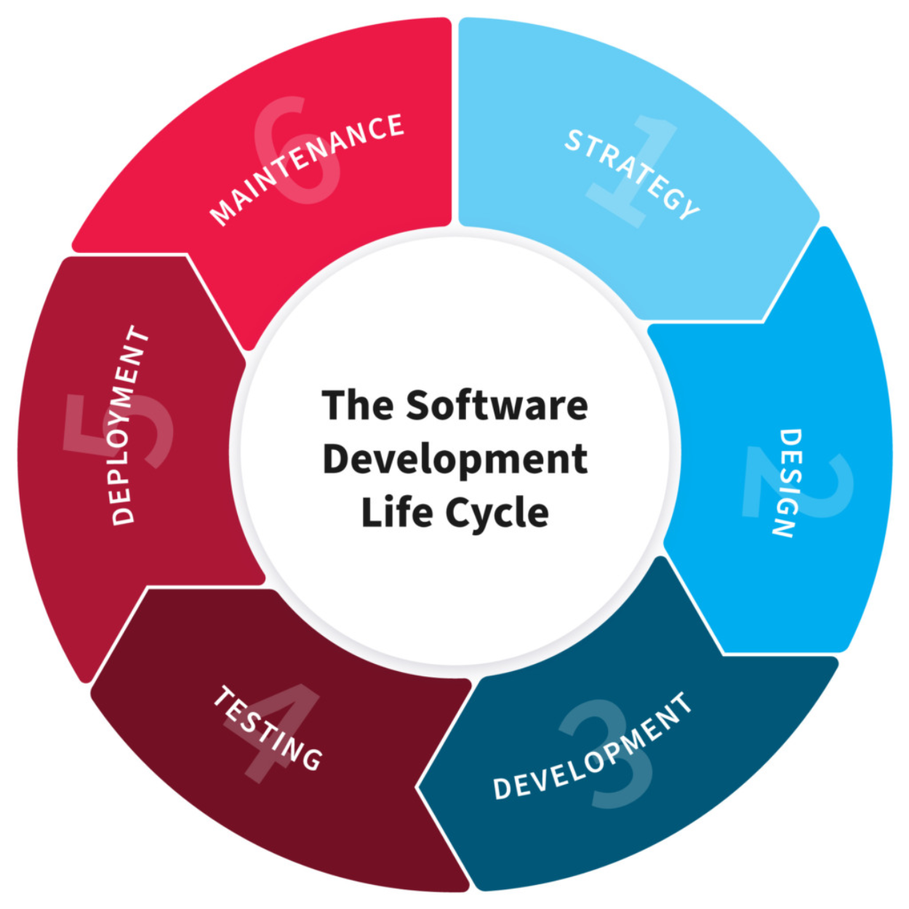

## Super pro tip:
No es lo mismo QA que QC. ¿Qué pasa? Cuando se buscan roles, casi siempre se busca por las siglas QA (o sea, quality assurance que es "garantizador de calidad" o aseguramiento de la calidad). ¡Atención! ¡Es un truco!

El acto de testear un software es un acto de QC (o sea, de quality control - controlamos que la calidad sea la que prometimos). Y QA se refiere al responsable de garantizar que todo el proceso desde los requerimientos hasta el final cumpla con los estándares de calidad prometidos. Que incluye, por supuesto, hacer testeos de código, pero también incluye procesos de desarrollo de código, testeos unitarios, testeos estáticos y otros procesos que tal vez un tester no realice nunca, ya que caen bajo la responsabilidad de los desarrolladores de software.

## El inglés es una necesidad de la industria
Si no lo han observado todavía, verán que la industria de la tecnología ha elegido al inglés como su lengua franca, o sea, el idioma universal en el cual se escribe, se produce y se trabaja en software y tecnología.
A medida que presentemos terminología específica de testing haremos especial hincapié en integrar los conceptos en inglés ya que en el mundo laboral serán muy necesarios. Les sugerimos, también, utilizar fuentes de estudio en inglés. Videos en YouTube con subtítulos activados y sitios web que los asistan a reforzar estos conceptos en inglés.

## La producción de software se puede iniciar por una de dos vías:
- Proyecto
- Producto

**Proyecto:** existe un cliente particular con una necesidad específica para su negocio. Ej: Una peluquería que trabaja con turnos que desea además cobrar en el momento en el que se gestiona el turno.
El cliente entonces contacta a un proveedor de software y le detalla sus necesidades. El desarrollador (puede ser un individuo o una compañía, muchas veces llamadas software factories) toma nota de los requerimientos, hace las preguntas necesarias para entender mejor aquellas cuestiones que el cliente no sabe especificar - si desea que sea posible tomar turnos en feriados, por ejemplo - y luego realiza un cotización en base al esfuerzo - horas y cantidad de desarrolladores necesarios. Si el cliente lo acepta, se inicia el proyecto.
Entonces: un proyecto es una solución particular para un cliente con necesidades específicas. Típicamente nos encontramos a entidades financieras, bancos, gobiernos y grandes empresas entre los clientes que solicitan soluciones a medida, con alto grado de confidencialidad y exigencia.
**Producto:**
La propuesta de software para un producto se inicia con la detección de una necesidad en el mercado. Por ejemplo, podemos decir que la compra remota es una necesidad que puede ser satisfecha a gran escala. Soluciones como Amazon, Ebay, Mercado Libre pretenden dar solución a esta necesidad. El camino es un poco distinto ya que el que produce el software responde casi siempre a un esfuerzo de un equipo (muchas veces una start up) que trabaja para entender cómo resolver ese problema de forma que muchos usuarios en el mundo deseen utilizar ese software. Entonces un producto pretende resolver un problema a gran escala y sus usuarios habitualmente van directo a consumirlo.

Para el ciclo de vida de desarrollo de software, ser un proyecto o ser un producto no cambia el orden en el que ocurren los pasos.

El ciclo de vida del desarrollo de software luce así:
1. Estrategia: Recopilación de requisitos y planificación /Strategy: requirements specification and planning
2. Diseño de software /Software design
3. Desarrollo de software /Software development
4. Prueba e Integración /Testing and integration
5. Despliegue /Deployment
6. Operacionalización y Mantenimiento / Operation and maintenance

_Existen varias versiones del gráfico o los pasos del ciclo de vida de la producción de software. La idea es comenzar a familiarizarse con la idea de que el momento del testing es un paso previo a la entrega del producto al cliente. Lo más probable es que en un proyecto real, estos pasos estén superpuestos. Por ejemplo: mientras se termina de desarrollar la fase 2, puede que el equipo de testing ya esté trabajando en las pruebas de la fase 1 y que también el cliente vaya viendo entregas parciales. Vamos a profundizar sobre este tema cuando veamos "Producción ágil de software" en encuentros futuros._

## Atención al detalle
Además de aprender las herramientas y los conceptos fundamentales del testing, vamos a estar trabajando sobre el desarrollo de habilidades esenciales para que nos desempeñemos sin errores desde el primer minuto como testers.
**La atención al detalle** es una habilidad que, como todas las habilidades, se entrena. Les proponemos un pequeño ejercicio de atención al detalle muy propio de las pruebas técnicas que pueden encontrar en una entrevista de trabajo. No se preocupen por cómo les va hoy. Usen sus resultados para entender mejor cuán desarrollada tienen esta habilidad y si tienen oportunidades para mejorarla con el tiempo.
