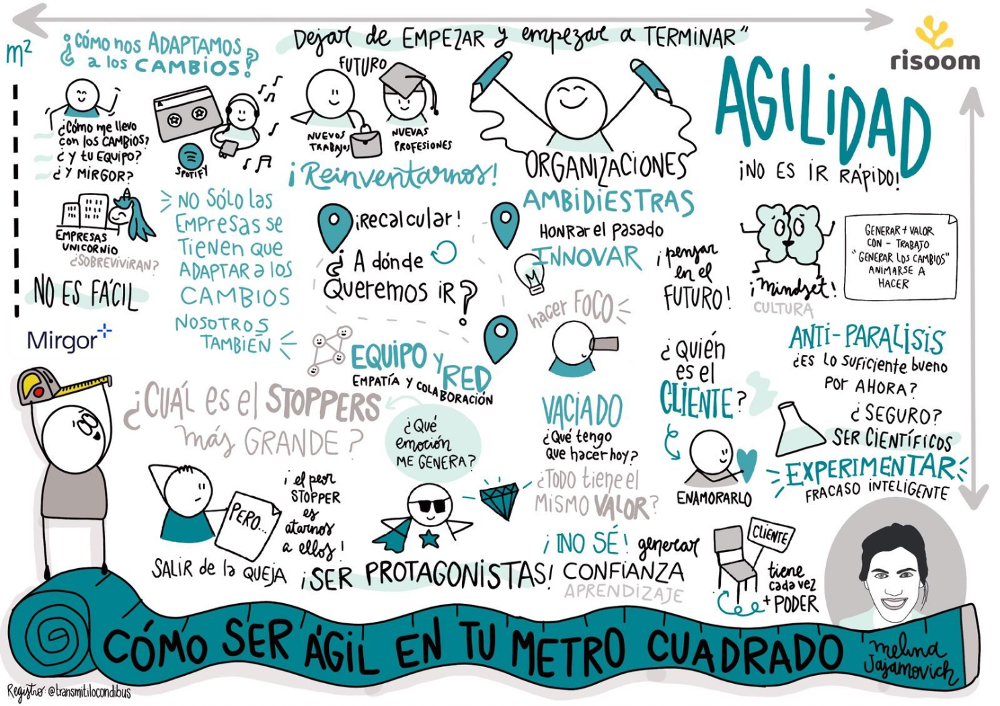
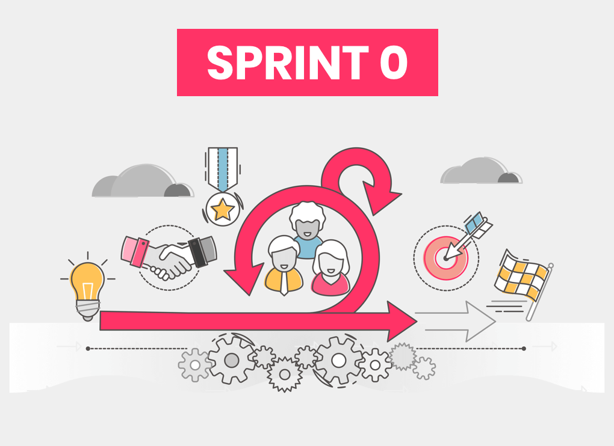
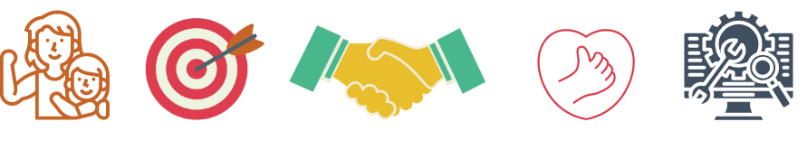
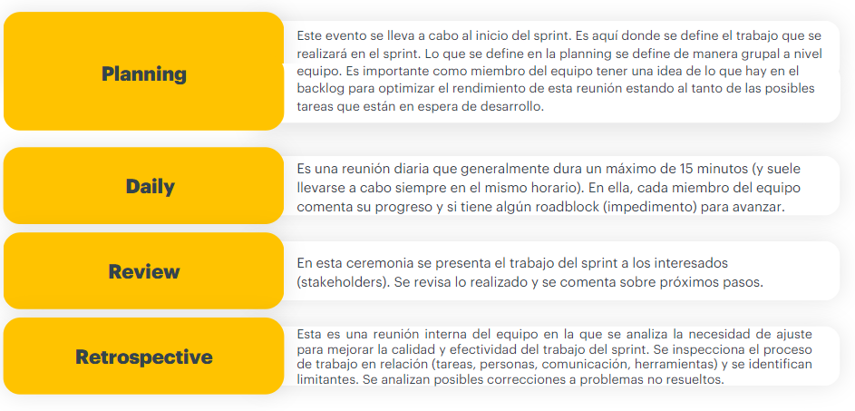

# Metodologías ágiles.

**¿Qué habilidades desarrollaremos?**
- Aprendizaje cooperativo entre pares
- Cultura de metodologías ágiles

**¿Qué herramientas técnicas aprenderemos?**
- Estrategias de testing ágil
- Herramientas para gestión de pruebas
- Ejecución de pruebas y generación de reportes

En las metodologías ágiles, como **Scrum**, se trabaja en entregas incrementales del software a través de iteraciones, ciclos o sprints, que son términos que se utilizan indistintamente para referirse al mismo concepto. Estos ciclos tienen una duración típica de 2, 3 o 4 semanas, aunque la duración puede variar según las necesidades y la dinámica del equipo.

Cada ciclo tiene un principio y un fin claramente definidos, y las actividades realizadas dentro de cada ciclo suelen ser consistentes. Algunas de las actividades comunes dentro de un ciclo ágil incluyen:

1. **Planificación del sprint**: Al comienzo de cada ciclo, el equipo se reúne para planificar las actividades que se llevarán a cabo durante ese período. Se definen los objetivos, se seleccionan las tareas a abordar y se establece una estimación del trabajo.

2. **Desarrollo de funcionalidades**: Durante el ciclo, el equipo se enfoca en la implementación de las funcionalidades definidas para ese sprint. Se lleva a cabo la codificación, las pruebas y la revisión del código, y se busca entregar incrementos de valor al final del ciclo.

3. **Reuniones diarias (Daily Stand-ups)**: A lo largo del ciclo, el equipo realiza reuniones diarias cortas para sincronizarse, compartir actualizaciones sobre el progreso, identificar obstáculos y coordinar esfuerzos.

4. **Revisiones y retrospectivas**: Al final del ciclo, se realiza una revisión en la que el equipo muestra los resultados obtenidos y recibe comentarios y sugerencias. Luego, se lleva a cabo una retrospectiva para reflexionar sobre el sprint y identificar oportunidades de mejora para futuros ciclos.

Estas son algunas de las actividades típicas que se llevan a cabo dentro de un ciclo ágil. El enfoque en entregas incrementales permite obtener retroalimentación temprana, ajustar las prioridades y responder rápidamente a los cambios en los requisitos o en el entorno del proyecto.

## Scrum

**Scrum** es una filosofía y un marco de trabajo que ayuda a las organizaciones a generar valor a través de soluciones adaptativas a problemas complejos. Esta metodología de trabajo emplea un enfoque iterativo e incremental para optimizar la previsibilidad y controlar el riesgo.

A diferencia de otros enfoques más prescriptivos, las reglas de Scrum no buscan proveer instrucciones detalladas. En cambio, Scrum se basa en la inteligencia colectiva de las personas que lo utilizan y fomenta la colaboración y la toma de decisiones conjuntas. Esto permite al equipo adaptarse y responder de manera flexible a medida que avanza en el desarrollo del proyecto.

El nombre "Scrum" se debe al enfoque centrado en el equipo, que trabaja de manera autónoma y colaborativa para alcanzar los objetivos establecidos. Algunos conceptos clave en Scrum incluyen:

- **Sprint**: Un período de tiempo fijo y corto (generalmente de 2 a 4 semanas) en el que se realiza un trabajo enfocado y se entrega un incremento de valor.

- **Product Backlog**: Una lista priorizada de elementos que representan los requisitos y funcionalidades del producto. Los elementos se mantienen en constante evolución y se ajustan según las necesidades del proyecto.

- **Daily Scrum**: Una reunión diaria de corta duración en la que el equipo se sincroniza, comparte actualizaciones y coordina las tareas para el día.

- **Sprint Review**: Una reunión al final de cada sprint en la que el equipo muestra los resultados alcanzados y recibe retroalimentación del stakeholder.

- **Sprint Retrospective**: Una reunión al final de cada sprint en la que el equipo reflexiona sobre su desempeño y busca oportunidades de mejora para futuros sprints.

Scrum fomenta la transparencia, la inspección y la adaptación continua. Al enfocarse en entregas incrementales y en la colaboración efectiva del equipo, Scrum permite a las organizaciones responder de manera ágil y efectiva a los cambios en los requisitos y en el entorno del proyecto.

En Scrum, los miembros del equipo se respetan, tienen el coraje de hacer lo correcto ante adversidades, son francos y asumen el compromiso de lograr sus objetivos apoyándose mutuamente, con un enfoque centrado en su principal tarea: el mejor progreso posible sobre el trabajo del sprint.

El Equipo Scrum es una pequeña unidad multifuncional y autogestionada de profesionales. No hay jerarquía dentro del equipo, y tienen la capacidad de decidir qué hacer, cómo hacerlo y cuándo hacerlo. Son responsables del ciclo de vida de desarrollo de una parte del producto.

Para mantener la agilidad y la eficiencia, generalmente los equipos Scrum son pequeños y suelen tener menos de 10 personas. Esto permite que el equipo sea ágil y pueda tomar decisiones rápidas, al mismo tiempo que cuenta con la cantidad suficiente de miembros para abordar y completar tareas significativas en cada sprint.

Al tener equipos pequeños, se promueve la comunicación y colaboración efectiva entre los miembros. Todos los integrantes del equipo son importantes y aportan su experiencia y habilidades para alcanzar los objetivos comunes. La colaboración y el apoyo mutuo son fundamentales para el éxito del equipo Scrum.

### Eventos de scrum
Existen cuatro eventos formales para inspección y adaptación dentro de cada sprint:

