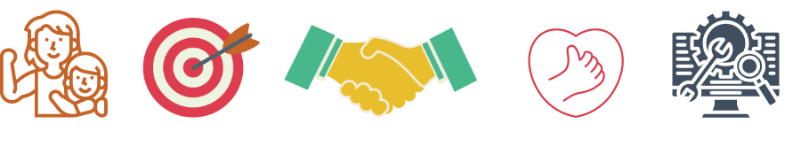
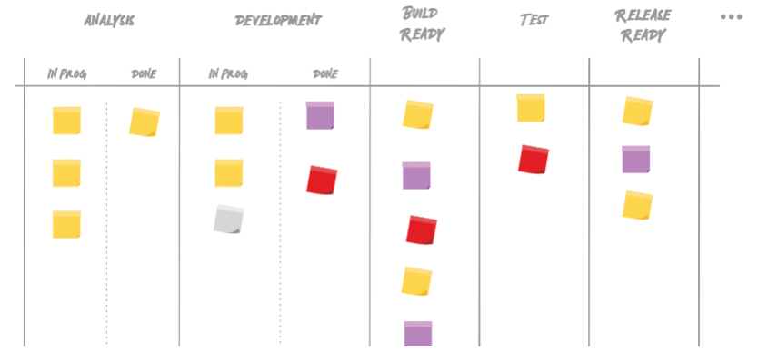

# Metodologías ágiles.

**¿Qué habilidades desarrollaremos?**
- Aprendizaje cooperativo entre pares
- Cultura de metodologías ágiles

**¿Qué herramientas técnicas aprenderemos?**
- Estrategias de testing ágil
- Herramientas para gestión de pruebas
- Ejecución de pruebas y generación de reportes

En las metodologías ágiles, como **Scrum**, se trabaja en entregas incrementales del software a través de iteraciones, ciclos o sprints, que son términos que se utilizan indistintamente para referirse al mismo concepto. Estos ciclos tienen una duración típica de 2, 3 o 4 semanas, aunque la duración puede variar según las necesidades y la dinámica del equipo.

Cada ciclo tiene un principio y un fin claramente definidos, y las actividades realizadas dentro de cada ciclo suelen ser consistentes. Algunas de las actividades comunes dentro de un ciclo ágil incluyen:

1. **Planificación del sprint**: Al comienzo de cada ciclo, el equipo se reúne para planificar las actividades que se llevarán a cabo durante ese período. Se definen los objetivos, se seleccionan las tareas a abordar y se establece una estimación del trabajo.

2. **Desarrollo de funcionalidades**: Durante el ciclo, el equipo se enfoca en la implementación de las funcionalidades definidas para ese sprint. Se lleva a cabo la codificación, las pruebas y la revisión del código, y se busca entregar incrementos de valor al final del ciclo.

3. **Reuniones diarias (Daily Stand-ups)**: A lo largo del ciclo, el equipo realiza reuniones diarias cortas para sincronizarse, compartir actualizaciones sobre el progreso, identificar obstáculos y coordinar esfuerzos.

4. **Revisiones y retrospectivas**: Al final del ciclo, se realiza una revisión en la que el equipo muestra los resultados obtenidos y recibe comentarios y sugerencias. Luego, se lleva a cabo una retrospectiva para reflexionar sobre el sprint y identificar oportunidades de mejora para futuros ciclos.

Estas son algunas de las actividades típicas que se llevan a cabo dentro de un ciclo ágil. El enfoque en entregas incrementales permite obtener retroalimentación temprana, ajustar las prioridades y responder rápidamente a los cambios en los requisitos o en el entorno del proyecto.

# Scrum

**Scrum** es una filosofía y un marco de trabajo que ayuda a las organizaciones a generar valor a través de soluciones adaptativas a problemas complejos. Esta metodología de trabajo emplea un enfoque iterativo e incremental para optimizar la previsibilidad y controlar el riesgo.

A diferencia de otros enfoques más prescriptivos, las reglas de Scrum no buscan proveer instrucciones detalladas. En cambio, Scrum se basa en la inteligencia colectiva de las personas que lo utilizan y fomenta la colaboración y la toma de decisiones conjuntas. Esto permite al equipo adaptarse y responder de manera flexible a medida que avanza en el desarrollo del proyecto.

El nombre "Scrum" se debe al enfoque centrado en el equipo, que trabaja de manera autónoma y colaborativa para alcanzar los objetivos establecidos. Algunos conceptos clave en Scrum incluyen:

- **Sprint**: Un período de tiempo fijo y corto (generalmente de 2 a 4 semanas) en el que se realiza un trabajo enfocado y se entrega un incremento de valor.

- **Product Backlog**: Una lista priorizada de elementos que representan los requisitos y funcionalidades del producto. Los elementos se mantienen en constante evolución y se ajustan según las necesidades del proyecto.

- **Daily Scrum**: Una reunión diaria de corta duración en la que el equipo se sincroniza, comparte actualizaciones y coordina las tareas para el día.

- **Sprint Review**: Una reunión al final de cada sprint en la que el equipo muestra los resultados alcanzados y recibe retroalimentación del stakeholder.

- **Sprint Retrospective**: Una reunión al final de cada sprint en la que el equipo reflexiona sobre su desempeño y busca oportunidades de mejora para futuros sprints.

Scrum fomenta la transparencia, la inspección y la adaptación continua. Al enfocarse en entregas incrementales y en la colaboración efectiva del equipo, Scrum permite a las organizaciones responder de manera ágil y efectiva a los cambios en los requisitos y en el entorno del proyecto.

En Scrum, los miembros del equipo se respetan, tienen el coraje de hacer lo correcto ante adversidades, son francos y asumen el compromiso de lograr sus objetivos apoyándose mutuamente, con un enfoque centrado en su principal tarea: el mejor progreso posible sobre el trabajo del sprint.

El Equipo Scrum es una pequeña unidad multifuncional y autogestionada de profesionales. No hay jerarquía dentro del equipo, y tienen la capacidad de decidir qué hacer, cómo hacerlo y cuándo hacerlo. Son responsables del ciclo de vida de desarrollo de una parte del producto.

Para mantener la agilidad y la eficiencia, generalmente los equipos Scrum son pequeños y suelen tener menos de 10 personas. Esto permite que el equipo sea ágil y pueda tomar decisiones rápidas, al mismo tiempo que cuenta con la cantidad suficiente de miembros para abordar y completar tareas significativas en cada sprint.

Al tener equipos pequeños, se promueve la comunicación y colaboración efectiva entre los miembros. Todos los integrantes del equipo son importantes y aportan su experiencia y habilidades para alcanzar los objetivos comunes. La colaboración y el apoyo mutuo son fundamentales para el éxito del equipo Scrum.

## Eventos de scrum
Existen cuatro eventos formales para inspección y adaptación dentro de cada sprint:

Dentro del equipo Scrum, existen roles clave que desempeñan funciones específicas:

**Scrum Master**: El Scrum Master es responsable de inculcar la metodología Scrum en el equipo. Su objetivo principal es facilitar y asegurar que el equipo siga las prácticas y los principios de Scrum. El Scrum Master actúa como un líder y un facilitador, eliminando obstáculos, fomentando la colaboración y promoviendo la mejora continua.

**Product Owner**: El Product Owner, también conocido como Dueño de Producto, es el responsable de maximizar el valor del producto. Trabaja en estrecha colaboración con el equipo Scrum y los stakeholders para definir y priorizar los elementos del backlog del producto. El Product Owner toma decisiones sobre qué características y funcionalidades se deben desarrollar y cuándo deben entregarse, siempre teniendo en cuenta las necesidades y expectativas de los usuarios y los stakeholders.

**Desarrolladores**: Los desarrolladores son los miembros del equipo que se dedican a resolver las tareas seleccionadas para cada sprint. Son profesionales multifuncionales y autónomos que trabajan en conjunto para desarrollar el incremento de valor durante cada ciclo. Los desarrolladores colaboran, se apoyan mutuamente y se esfuerzan por entregar un trabajo de alta calidad.

Cada uno de estos roles tiene responsabilidades específicas dentro del equipo Scrum y colabora activamente para lograr los objetivos del proyecto.

### Para saber más sobre Scrum
En https://scrumguides.org/download.html se puede encontrar la guia oficial de scrum (actualizada en 2020) escrita por sus creadores (Jeff Sutherland y Ken Schwaber) y traducciones a diferentes idiomas hechas por miembros de la comunidad.

# KANBAN 

El método Kanban es parte de la estrategia japonesa de trabajo conocida como Kaizen, que se basa en la premisa de que siempre se pueden hacer las cosas mejor. Su propósito es evitar la pérdida de competitividad en el mercado al fomentar la mejora continua de los hábitos de trabajo.

**Orígenes**

En japonés, Kanban significa "letrero" o "señal". Surgió a fines de la década de 1940 como un sistema utilizado en entornos de fabricación con el objetivo de controlar el proceso de producción mediante un enfoque Just-in-Time (JIT), basado en la demanda. Cuando se vende un producto, la señal se mueve al comienzo de la línea de producción para indicar que se debe producir uno nuevo. El propósito es minimizar los desperdicios y optimizar los flujos de trabajo.

El Kanban es un sistema de gestión de procesos visuales que indica qué producir, cuándo producirlo y en qué cantidad.

## Método Kanban

El método Kanban, formulado por David J. Anderson, es un enfoque para el cambio evolutivo incremental en las organizaciones de desarrollo. Es una aproximación a la mejora de los procesos organizacionales de manera gradual y evolutiva.

El método Kanban limita el trabajo en curso (WIP) o trabajo en progreso para exponer los problemas en el sistema o proceso, fomentando la colaboración para la mejora continua. El proceso de cambio hacia la mejora se realiza de forma gradual y evolutiva.

El proceso, desde la definición de la tarea hasta su entrega, se muestra visualmente a los participantes utilizando tableros Kanban o Kanban boards, como se muestra en la imagen adjunta. Las tarjetas utilizadas en el Kanban no funcionan solo como señales para realizar más trabajo, sino que representan los elementos de trabajo en sí mismo.

El Kanban fomenta la transparencia, la colaboración y la visualización del flujo de trabajo, lo que ayuda a identificar y resolver problemas de manera más efectiva.

## Principios fundamentales del Método Kanban

El Método Kanban se rige por algunos principios fundamentales que guían su aplicación y fomentan la mejora continua:

1. **Comenzar con la actividad actual**: El Método Kanban no exige un cambio drástico en el proceso existente, sino que se basa en la evolución gradual del proceso. Se comienza trabajando de la manera en que se hacía previamente, respetando los procesos, roles, responsabilidades y cargos establecidos. Con el tiempo, se implementan mejoras incrementales para optimizar el rendimiento.

2. **Acuerdo sobre el cambio continuo, incremental y evolutivo**: Para aplicar el Método Kanban, es necesario contar con un acuerdo en la organización o en el equipo, reconociendo la importancia de trabajar en pequeñas mejoras incrementales. Se entiende que el cambio continuo y evolutivo es esencial para el progreso y la adaptación a los desafíos y cambios del entorno.

3. **Liderazgo en cada nivel**: Es importante que en todos los niveles de la organización exista un liderazgo que fomente la mejora continua y el rendimiento óptimo. En el Método Kanban, se reconoce que la información sobre dónde se pueden realizar mejoras puede surgir en cualquier nivel, incluso a nivel de los contribuyentes individuales. Se busca crear una cultura de seguridad donde todos los miembros se sientan libres de proporcionar feedback, hacer propuestas y tomar iniciativas de mejora, respaldadas por explicaciones lógicas y datos.

El Método Kanban promueve la participación activa y la apertura a la retroalimentación de todos los miembros de la organización, fomentando un entorno propicio para la mejora continua.

## Prácticas centrales del Método Kanban

1. **Visualizar el flujo de trabajo**: La visualización del flujo de trabajo es fundamental para comprender cómo avanza el trabajo. Representar cada actividad con tarjetas o columnas ayuda a hacer visible la secuencia de actividades y los estados del flujo de trabajo.

2. **Limitar el trabajo en curso**: Limitar el trabajo en progreso implica establecer un sistema de "extracción" o "ingreso" de nuevas actividades. Es importante mantener un límite para el trabajo en curso en cada estado del flujo, permitiendo que se ingrese nueva actividad solo cuando hay capacidad para manejarla.

3. **Manejar y monitorear el flujo de trabajo**: El flujo de actividades a través de cada estado del flujo debe ser monitoreado. Se utilizan reportes para medir la velocidad con la que avanzan las tareas en cada estado y así identificar cuellos de botella. Esto facilita la mejora continua y la optimización del flujo de trabajo.

4. **Hacer explícitos los procesos y políticas**: Es importante que los procesos y políticas, o la falta de ellos, estén claros y sean conocidos por todos los miembros del equipo. Identificar los procesos existentes o definir nuevos procesos es crucial para la revisión y mejora continua.

5. **Usar circuitos de retroalimentación**: La retroalimentación es fundamental para ajustar y mejorar los procesos y políticas. Se compara el resultado esperado con el resultado real y se toman decisiones para realizar modificaciones necesarias.

6. **Mejorar la colaboración**: Trabajar en equipo fomenta la construcción de una visión compartida y la colaboración en la resolución de problemas. Cuando los equipos colaboran, pueden proponer acciones de mejora acordadas por consenso.

Algunas herramientas que se pueden utilizar para implementar el Método Kanban son:
- Kanban Tool
- JIRA
- Trello
- Note Board
- Targetprocess
- Notas adhesivas (análogicamente)

Estas herramientas proporcionan una plataforma para gestionar visualmente el flujo de trabajo y aplicar las prácticas centrales del Método Kanban.

### Recursos utiles:

- https://djaa.com/kanban-board-examples/
- https://djaa.com/revisiting-emerging-roles-in-kanban/
- https://djaa.com/kanban-evergreen-should-we-include-waiting-or-blocked-items-in-wip-limits/
- https://djaa.com/revisando-los-principios-y-practicas-generales-del-metodo-kanban/
- https://djaa.com/applying-kanban-to-sales/
- https://djaa.com/individual-kanban-faq/
- https://djaa.com/applicability-of-the-kanban-method-to-the-legal-sector/

**_SCRUM y KANBAN no son excluyentes entre sí._**
_Los equipos de trabajo pueden usar scrum para su operativa y Kanban para monitorear y verificar que los procesos fluyan con la agilidad necesaria o para hacer ajustes globales, de ser  necesario._

Ahora que tenemos una idea mucho más clara de cómo es el desarrollo ágil, su metodología, roles y responsabilidades, hablemos de las habilidades necesarias para trabajar en el marco de estas metodologías.
 
Compromiso, foco, franqueza, respeto y coraje son los valores de Scrum.
A estos podríamos sumar las siguientes características necesarias para el éxito de los proyectos de desarrollo en los que participes:
- Responsabilidad
- Compromiso
- Organización
- Manejo de proyectos (Project Management)
- Manejo de tiempos (Time Management)
- Capacidad de trabajo en equipo
- Flexibilidad
- Entusiasmo
- Curiosidad
- Creatividad
- Honestidad
- Pensamiento crítico
- Capacidad de decisión
- Capacidad de aprendizaje

### Más recursos utiles:
- https://www.getsoftwareservice.com/roles-and-responsibilities-of-quality-analyst-in-software-development/
- https://www.kualitee.com/testing/anatomy-qa-tester/

## Estrategias de Testing Ágil

En el marco del desarrollo de software ágil, es importante definir una estrategia de testing que permita planificar los procesos y adaptarse a los cambios en los equipos de trabajo. Una estrategia de testing validada y documentada es fundamental para evitar la pérdida de información y conocimientos, incluso cuando los miembros del equipo cambien de proyecto.

Algunas estrategias de testing ágil que se pueden considerar incluyen:

1. **Integración temprana de testing**: En lugar de dejar el testing para el final del ciclo de desarrollo, se busca incorporar actividades de testing desde las primeras etapas. Esto ayuda a detectar y corregir problemas a medida que se desarrolla el software, evitando acumular errores y retrasos en etapas posteriores.

2. **Automatización de pruebas**: La automatización de pruebas es clave en el desarrollo ágil, ya que permite ejecutar casos de prueba de manera rápida y repetitiva. Esto acelera el proceso de testing y ayuda a mantener la calidad del software a medida que se realizan cambios o se agregan nuevas funcionalidades.

3. **Enfoque en pruebas de regresión**: Dado que en el desarrollo ágil se realizan cambios y entregas frecuentes, es importante enfocarse en las pruebas de regresión. Estas pruebas aseguran que las funcionalidades existentes sigan funcionando correctamente después de cada cambio realizado.

4. **Colaboración y comunicación constante**: El testing ágil requiere una estrecha colaboración entre los miembros del equipo de desarrollo y los testers. La comunicación constante ayuda a comprender los requisitos, identificar los riesgos y definir las estrategias de testing más adecuadas para cada iteración.

5. **Pruebas exploratorias**: Las pruebas exploratorias son una parte integral del enfoque ágil. Los testers pueden aprovechar su experiencia y conocimiento del software para explorar diferentes escenarios y realizar pruebas ad hoc. Esto ayuda a descubrir problemas y mejorar la calidad del software de manera iterativa.

6. **Feedback y mejora continua**: El enfoque ágil promueve el feedback y la mejora continua. Los resultados de las pruebas, los informes de errores y las lecciones aprendidas se utilizan para retroalimentar y mejorar el proceso de desarrollo y testing en cada iteración.

Es importante adaptar la estrategia de testing a las necesidades y características específicas de cada proyecto y equipo. Una estrategia bien definida y documentada brinda dirección y asegura que el proceso de testing sea eficiente y efectivo a lo largo del ciclo de desarrollo.

## Tipos de Estrategias de Testing

Existen diferentes tipos de estrategias para abordar las tareas de testing, cada una con enfoques y objetivos específicos. Algunos de los tipos de estrategias más comunes son:

1. **Estrategia Analítica**: Esta estrategia se basa en un análisis sistemático de los requerimientos del sistema y/o en el análisis de los riesgos asociados. Se busca identificar los aspectos críticos y las áreas de mayor impacto para enfocar los esfuerzos de testing de manera efectiva.

2. **Estrategia Basada en Modelos**: Esta estrategia se basa en el uso de modelos para analizar el comportamiento del sistema. Por ejemplo, se pueden utilizar modelos UML, tablas de decisión o diagramas de transición de estados para diseñar y ejecutar casos de prueba.

3. **Estrategia Metódica**: Esta estrategia se basa en el uso de conjuntos de pruebas estándar o checklists de pruebas predefinidos. Se establecen criterios y procedimientos específicos que deben seguirse en todas las pruebas, asegurando una cobertura adecuada de los aspectos críticos del sistema.

4. **Estrategia Basada en Estándares**: Esta estrategia sigue los lineamientos y estándares establecidos por organismos externos o normativas como ISO. Se enfoca en cumplir con los requisitos y regulaciones específicas establecidas por esos estándares.

5. **Estrategia Reactiva**: Esta estrategia se basa en reaccionar a los desarrollos que ya están listos para ser testeados. Se analiza y se realizan pruebas una vez que el sistema o componente está completamente desarrollado. Esto puede ser útil en situaciones en las que no es posible realizar pruebas durante el proceso de desarrollo.

6. **Estrategia Consultiva**: Esta estrategia se basa en la consulta y el consejo de expertos externos al equipo de testing. Se busca obtener una visión objetiva y una evaluación imparcial del sistema, aprovechando la experiencia y conocimientos de profesionales especializados.

Es importante elegir la estrategia de testing más adecuada según las necesidades y características del proyecto. En muchos casos, se puede combinar diferentes enfoques para obtener una cobertura integral y efectiva.

_Puede que algunas empresas utilicen un mix de estas estrategias sin tener una definida. En ocasiones  alguna empresa o grupos de trabajo tienen estrategias bien consolidadas que se aplican a conciencia._
_De hecho, el equipo podría decidir modificar el tipo de estrategia elegida dependiendo del tipo de proyecto en el que esté trabajando._

Una estrategia de testing es concretamente la definición de cómo deben llevarse a cabo las tareas de testing y aquellas relacionadas a las pruebas de software;
¿Qué tareas se llevan a cabo? ¿cómo se abordan? ¿en qué orden? ¿por quién? 
 
¿Qué táctica usar para el testing ágil?
En el mejor de los casos un mix de los modelos que mencionamos anteriormente.

_En el marco del desarrollo ágil es valioso ser ordenado, responsable y metódico._
_Es útil adelantar todo el trabajo posible para maximizar la eficiencia y la eficacia (en nuestro rol de identificar defectos). También es clave tener la flexibilidad para adaptarse y decidir cómo seguir cuando un plan cambia._

_A la hora del diseño del plan de pruebas, es recomendable empezar por una lista de pruebas que consistan en: Id, título y una descripción._
_Una vez que se generó el borrador con todas las descripciones de casos de prueba trabajar en los detalles de cada prueba._
_Ten en cuenta que el título y la descripción deberían ser suficientes para entender exactamente qué debe es lo que debe probar la prueba._
_De esta manera tendremos una lista con una descripción de todo lo que debemos probar en su totalidad._

### En en la etapa estática se podría:

- Analizar requerimientos y modelos disponibles, para darle forma a las pruebas y cubrir requerimientos, flujos y transiciones de estado, siempre contemplando la variable riesgo para asignar prioridad.
- Revisar si hay sets de pruebas comunes que apliquen para el objeto bajo test. De ser así, agregarlo al plan. Por ejemplo: si el sistema tiene formularios es posible que se puedan aplicar pruebas que son comunes y requeridas para formularios
- Revisar si el sistema bajo test aplica para ser testeado bajo algún estándar. Por ejemplo: si el sistema debe cumplir con reglas de accesibilidad entonces deberían agregarse las pruebas correspondientes al plan de pruebas.
- Consultar con expertos en la materia para asegurarse de que se están cubriendo todos los aspectos claves del sistema y en caso de que se nos hubiera pasado algún caso de uso, agregarlo. Quizás el sistema en desarrollo está relacionado a un área que no resulta  familiar. Siempre es útil consultarla con un experto o SME – subject matter expert.
- Reportar los defectos que se hayan encontrado en la documentación, aclarar las dudas con las personas correspondientes, terminar de armar el plan de pruebas.
 
**Una vez armado el plan de pruebas preparar el ambiente para ejecutar las pruebas cuando el sistema esté listo.** 

Si se avanza con el análisis en la etapa estática, es decir, antes de que el sistema esté listo para testearse lo único que queda, es ejecutar las pruebas. Hecho así, la etapa de ejecución puede ser una tarea bastante simple. Incluso puede delegarse o distribuirse entre varias personas.
En el marco del desarrollo ágil podría pasar que tenemos nuestro análisis incompleto o recién iniciado y el producto ya está listo para testearse. En ese caso sería válido usar una estrategia reactiva: hacer el trabajo inverso, probar el sistema, explorarlo y tomar nota de los hallazgos.
Otra manera es probar el sistema a la par de la revisión de la documentación de requerimientos o historias de usuario o de cualquier otra documentación que tengamos a disposición.

**En resumen:**
Es recomendable anticipar las tareas de análisis, diseño de plan y preparación de ambiente para las pruebas.
En caso de suspender el diseño de nuestro plan de pruebas y necesitar comenzar la ejecución de pruebas directamente, es bueno contar con al menos un borrador de las pruebas más críticas.

### Info Adicional
- ¿Qué es integración continua? https://www.atlassian.com/es/agile/software-development/continuous-integration

**Herramientas populares de automatización:**
En exploradores web: Selenium, Cucumber, Puppeteer, Playwright, Testcafe, Cypress.
En mobile: Appium, Detox, Calabash.
